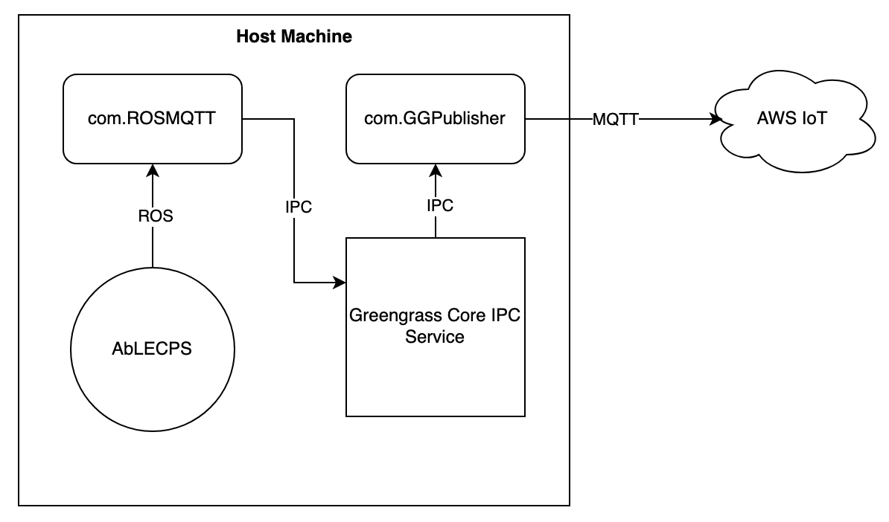

## Overview
This is a ROS/MQTT AWS messaging layer designed to take relevant ROS messages from AbLECPS and relay them to AWS IoT Core's MQTT broker. It is deployed as two Greengrass components onto a Core device (the same device running the simulation).

Tested and working on Ubuntu 18.04.

## How it Works
In the com.ROSMQTT component, he `network_detect.py` script is constantly listening for new docker networks to be created. When it notices that AbLECPS creates one (AbLECPS spins up a new docker network for each run of the simulation with the form network_123), it creates our listener container and hooks it into that network. In the container, `ros-listener.py` listens for selected topics and relays those messages to `aws-publisher.py`. The aws-publisher script then uses Greengrass IPC to publish to a local topic, which is picked up by our script running in our other Greengrass component, com.GGPublisher. This has a simple script which will listen for any local Greengrass messages and send them to the AWS IoT MQTT broker after parsing.

### Architecture Diagram

## Setup
*NOTE: This setup assumes you have an AWS account and AbLECPS installed. This was tested on an amd64 architecture system with Ubuntu 18.04*

Fork this repository and clone it to your machine. Next, follow [these](https://docs.aws.amazon.com/greengrass/v2/developerguide/getting-started.html) instructions to get the AWS Greengrass Core software _and sdk and cli_ working on the machine. You'll also need the AWS cli to authenticate.

Make sure you have Python 3.13 installed on the machine. 

`cd` into com.ROSMQTT. In the gdk-config.json file, modify the region to whatever AWS region you are using. Before we build and publish our custom component, we have to grant some permissions. Follow [these](https://docs.aws.amazon.com/greengrass/v2/developerguide/device-service-role.html#device-service-role-access-s3-bucket) instructions, making sure to change the bucket in component-artifact-policy to your component bucket. Once you've completed that, run `gdk component build` and `gdk component publish`. This will publish your component to Greengrass. `cd` into com.GGPublisher, editing gdk-config.json as needed, and once again run `gdk component build` and `gdk component publish`. You should now be able to see both of these components in the AWS IoT components menu webpage. 

In the last step before deploying these components, you'll need to edit the policy that you attached to the core device to allow the core device to publish messages to the IoT MQTT broker. Navigate to Security->Policies and select the policy you created. You'll want to allow * for the filter resources - they'll look like `arn:aws:iot:us-east-2:12345678:topic/iot/*`. You'll need to do this for topic/iot/* and topic/iot/bluerov and topic/iot/bluerov/commands.

Finally, we can deploy our components. On the AWS IoT webpage, navigate to Deployments and click Create. Set the deployment target to Core Device and enter your core device's name. From the My Components list, select the two components we uploaded. Select the aws.greengrass.Cli component from the Public Components list. Click Next a few times and then click Deploy. After a little while you should see Deployment Status: Completed and Device Status: Healthy. *Note: you might've created a deployment when following the getting started tutorial. In that case click on said deployment and go to Actions->Revise and follow the above steps.*

Finally, open the MQTT Test Client, change the topic filter to '#', and press subscribe. In AbLECPS, once you're logged into admin and click on BlueRov, navigate to ALC/Construction/Testing and double click on cp1_00. Go to the top left play button -> Launch Activity -> Run. After some time you should begin to see messages coming through to your MQTT test client. This means your setup is working correctly!

This should provide a good jumping off point for interacting with the simulator and getting familiar with Greengrass components.

## Troubleshooting
It is entirely possible I may have missed mentioning an AWS permission somewhere. The errors are usually pretty descriptive and can give you a sense of which permission you should enable. If you find there's a permission that I forgot to describe please reach out and I will add it to the readme ASAP. 

I found the `docker logs` command to be very valuable, and you can view your component's logs by running `sudo cat /greengrass/v2/logs/COMPONENT_NAME.log`. This should help with debugging most errors. As always, the AWS documentation is extremely valuable.

The `topics.txt` file contains some of the topics found in the BlueROV sim. `listener.py` is a helper script that will display all ROS topics for a certain ROS network